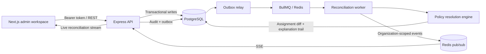

# Policy Assignment System

A multi-tenant policy resolution platform for determining which organizational
policies apply to each employee, at a given point in time, with deterministic
conflict resolution and a durable explanation of every decision.

The system is designed for People Operations and company administrators managing
policy-driven workflows such as time off, pay schedules, benefits, compliance,
work schedules, application access, and organizational relationships.

## What the product does

- Models employees, policy categories, policies, groups, assignment rules, and manual overrides.
- Evaluates rules against department, location, employment type, role, tenure, managerial status, and group membership.
- Supports categories allowing one assignment (`SINGLE`) or several assignments (`MULTIPLE`) per employee.
- Resolves conflicts with a stable total order and records both winners and non-winning rules.
- Materializes effective-dated assignments for efficient point-in-time reads.
- Reconciles affected employees asynchronously after relevant employee, group, or rule changes.
- Preserves rule versions, employee attribute history, audit events, matched clauses, failed clauses, and evaluated values.
- Provides an admin workspace for employees, policies, rules, groups, audit, reconciliation activity, and settings.

## Current status

This repository contains a working product implementation, not only a system design exercise. The core domain engine, API, PostgreSQL schema, outbox relay, BullMQ worker, Redis-backed live reconciliation stream, seed workflow, and most of the admin frontend are present.

It should still be treated as an active MVP rather than production-ready software. There is no automated test suite, deployment packaging is not defined, several workflows remain incomplete, and some documents describe an older implementation state. See [Known limitations](#known-limitations) and [Documentation](#documentation).

## Architecture



PostgreSQL is the source of truth. Redis is used for queueing, rate limiting, and transient live-event delivery, but authoritative employee, rule, policy, assignment, and audit state remains recoverable from PostgreSQL.

Changes that affect policy resolution write an outbox event in the same database transaction as the domain change. The relay claims those rows and creates idempotent reconciliation jobs. The worker recomputes the desired policy state and persists only the difference.

## Resolution semantics

Rules are evaluated against an employee and an `asOf` calendar date. Rule conditions are currently a versioned, flat `AND` expression.

For competing rules, the engine uses this deterministic order:

1. Numeric priority, descending.
2. Rule-type band, descending, when priorities tie.
3. Creation time, ascending.
4. Rule ID, ascending.

In a `SINGLE` category, the first matching rule wins. In a `MULTIPLE` category, each distinct policy may be assigned, while duplicate claims for the same policy still resolve to one source rule.

Manual overrides are represented as `MANUAL` rules targeting one employee. In the current implementation, they participate in the same ordering and do not automatically beat a rule with a higher numeric priority.

Effective periods are half-open calendar-day ranges:

```text
effectiveFrom <= asOf && (effectiveTo is null || effectiveTo > asOf)
```

## Repository layout

| Path | Responsibility |
| --- | --- |
| `apps/api` | Express 5 HTTP API, authentication, authorization, validation, and application services |
| `apps/worker` | Transactional-outbox relay, BullMQ processing, retries, fan-out, and live event publication |
| `apps/dashboard-panel` | Next.js 16 admin workspace and public product landing page |
| `packages/core` | Resolution engine, reconciliation service, repositories, and fan-out logic |
| `packages/db` | Prisma schema, migrations, shared client, and API-driven demo seed |
| `packages/shared` | Framework-independent DTOs, enums, permissions, conditions, errors, and constants |
| `infra` | Local PostgreSQL and Redis Docker Compose services |
| `docs` | Product requirements, architecture, persistence, API history, and frontend specification |

The API follows a one-way dependency structure:

```text
Routes -> Controllers -> Services -> Repositories -> Prisma
```

The resolution engine remains independent of Express, BullMQ, and Redis so it can be evaluated as pure domain logic.

## Technology

- TypeScript, Node.js, Express 5
- Next.js 16, React 19, Tailwind CSS 4
- TanStack Query and TanStack Table
- React Hook Form and Zod
- PostgreSQL 16, Prisma 6
- Redis 7 and BullMQ 5
- npm workspaces

## Prerequisites

- Node.js 20.9 or newer
- npm
- Docker with Docker Compose

## Local setup

Install workspace dependencies:

```bash
npm install
```

Create local environment files from the checked-in examples:

```powershell
Copy-Item apps/api/.env.example apps/api/.env
Copy-Item apps/worker/.env.example apps/worker/.env
Copy-Item packages/db/.env.example packages/db/.env
Copy-Item apps/dashboard-panel/.env.example apps/dashboard-panel/.env.local
```

Replace `JWT_SECRET` in `apps/api/.env` before using the application outside an isolated local environment. Despite the legacy variable name, it is used as the HMAC pepper for opaque session tokens, not as a JWT signing key.

Start PostgreSQL and Redis:

```bash
docker compose -f infra/docker-compose.yml up -d
```

Generate the Prisma client and apply development migrations:

```bash
npm run prisma:generate
npm run prisma:migrate
```

Start the three application processes in separate terminals:

```bash
# API at http://localhost:3000
npm run dev

# Outbox relay and reconciliation worker
npm run dev:worker

# Web application at http://localhost:3001
npm run dev:web
```

The API health endpoint is available at `http://localhost:3000/health`. The versioned API base path is `http://localhost:3000/api/v1`.

## Demo data

With PostgreSQL, Redis, the API, and the worker running, seed a realistic demo organization through the public API:

```bash
npm run seed
```

The seed intentionally uses HTTP rather than direct inserts so authentication, validation, audit records, employee history, rule versioning, outbox delivery, and reconciliation all execute through the real application path. It is idempotent for the included demo organization and prints the available role credentials when it finishes.

## Useful commands

| Command | Purpose |
| --- | --- |
| `npm run dev` | Build shared backend packages and run the API in watch mode |
| `npm run dev:worker` | Build shared packages and run the worker in watch mode |
| `npm run dev:web` | Run the dashboard on port 3001 |
| `npm run build` | Build shared packages, database package, API, and worker |
| `npm run build:web` | Create the Next.js production build |
| `npm run typecheck` | Run the repository's backend build-based type check |
| `npm run prisma:generate` | Generate the Prisma client |
| `npm run prisma:migrate` | Apply development migrations |
| `npm run prisma:studio` | Open Prisma Studio |
| `npm run seed` | Populate the running system through the API |

Frontend-specific checks:

```bash
npm run typecheck --workspace dashboard-panel
npm run lint --workspace dashboard-panel
```

No automated unit, integration, component, or browser test command is currently defined.

## API conventions

- All product endpoints are mounted under `/api/v1`.
- `POST /auth/signup`, `POST /auth/login`, and `GET /health` are public.
- Authenticated requests use `Authorization: Bearer <opaque-token>`.
- Organization scope comes from the authenticated session and is never trusted from request input.
- Successful responses use `{ "success": true, "data": ... }`.
- Failures use `{ "success": false, "message": "...", "code": "..." }`.
- List endpoints use `limit` and `offset` pagination.
- Point-in-time reads use `asOf=YYYY-MM-DD` where supported.
- Clients should branch on stable error codes rather than message text.

Major API areas include authentication, organization users, employees, groups, policy categories, policies, rules, assignments, explanations, manual overrides, application access, reconciliation status and events, live reconciliation SSE, and audit events. Route files under `apps/api/src/routes` are the current source of truth for the exact HTTP surface.

## Security and correctness invariants

- Every organization-scoped query is constrained by the authenticated session.
- Authorization is enforced server-side with shared role-permission mappings.
- Untrusted request bodies and query parameters are validated with Zod.
- Assignment-affecting writes, audit records, and outbox events are committed transactionally where consistency requires it.
- Reconciliation is designed to be idempotent and safe under duplicate delivery.
- Rule versions and resolution events preserve the inputs needed to explain historical decisions.
- Redis loss must not destroy authoritative business state.

These invariants are design goals backed by the current implementation, but the absence of automated security and integration tests remains a material risk.

## Known limitations

- There is no automated test suite or CI workflow in the repository.
- There is no production deployment definition, TLS/reverse-proxy configuration, secret-management integration, monitoring stack, or infrastructure as code.
- Rule conditions support flat `AND` expressions only.
- Rule edits use last-write-wins semantics without optimistic concurrency.
- Assignment history is not exposed as a dedicated employee endpoint or UI.
- Failed outbox rows can be inspected but do not have a retry endpoint.
- Policy archival does not enqueue reconciliation, so assignments may remain until another reconciliation trigger runs.
- Employee list and detail attribute reads are not point-in-time; the UI labels that limitation while showing historical assignments.
- Manual override creation and revocation are supported by the backend but are not exposed in the admin workspace.
- Employee editing does not yet cover every editable attribute, manager changes, or effective-date selection.
- Employee-specific audit and combined history views remain incomplete.
- Several destructive or assignment-affecting actions still need consistent, consequence-aware confirmations.
- Access policies have a backend read/write model but no dedicated admin UI.
- Additional roles can authenticate, but the MVP workspace is intentionally limited to company and HR administrators.

## Documentation

Start with these documents:

- [`AGENTS.md`](AGENTS.md): repository-wide product context and implementation instructions.
- [`docs/notes.md`](docs/notes.md): product requirements and domain intent.
- [`docs/architecture.md`](docs/architecture.md): system architecture and reliability model.
- [`docs/database.md`](docs/database.md): persistence model.
- [`docs/design.md`](docs/design.md): current v2 frontend product specification.
- [`docs/design-review.md`](docs/design-review.md): decisions, implementation corrections, and verification history.
- [`docs/landing.md`](docs/landing.md): public landing-page brief.
- [`docs/design-pattern.md`](docs/design-pattern.md): frontend visual and interaction principles.

`docs/apis.md`, `docs/frontend.md`, and `docs/ideas.md` are useful historical design inputs, but they do not accurately represent the current build status. In particular, `docs/apis.md` still marks multiple implemented capabilities as blocked or unbuilt. Verify endpoint availability against the route files and the newer design review before planning work from that document.

## License

No license has been specified for this repository.
